# NLP Telegram Bot

A Natural Language Processing Telegram bot with text analysis, tokenization, lemmatization, n-grams analysis, sentiment classification, and visualizations.

### Quick Start

1. Create Virtual Environment
```bash
# Windows
python -m venv venv
venv\Scripts\activate

# macOS/Linux
python3 -m venv venv
source venv/bin/activate
```

2. Install Dependencies
```bash
pip install -r requirements.txt
```

3. Configure Telegram Token
Open `main.py` and replace the TOKEN:
```python
TOKEN = "your_telegram_bot_token_here"
```
Get your token from [@BotFather](https://t.me/botfather)

4. Run the Bot
```bash
python main.py
```

## Commands

| Command | Usage | Description |
|---------|-------|-------------|
| `/start` | `/start` | Initialize bot |
| `/task` | `/task tokenize "text" class` | Process text (tokenize, lemmatize, stemming, stats, n-grams, plot_histogram, plot_wordcloud) |
| `/full_pipeline` | `/full_pipeline "text" class` | Complete analysis with all steps |
| `/classifier` | `/classifier "text"` | Sentiment classification |
| `/stats` | `/stats` | Database statistics |


## File Structure
```
program/
├── main.py              # Bot code
├── sentences.py         # Data management
├── senteces.json        # Database (auto-created)
├── requirements.txt     # Dependencies
└── readme.md           # This file
```

## Requirements
- Python 3.8+
- Telegram Bot Token

## Deactivate Virtual Environment
```bash
deactivate
```

## Photo examples

### Step-by-Step Guide

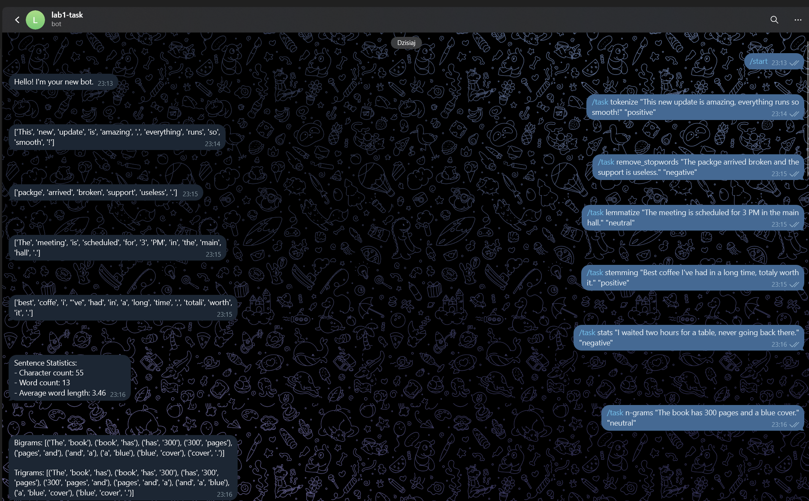
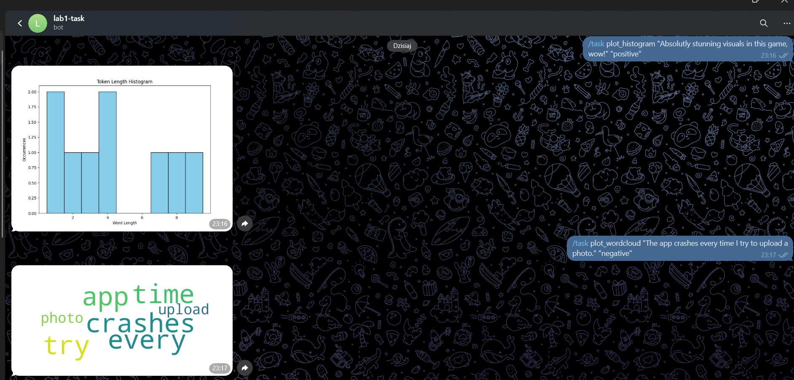
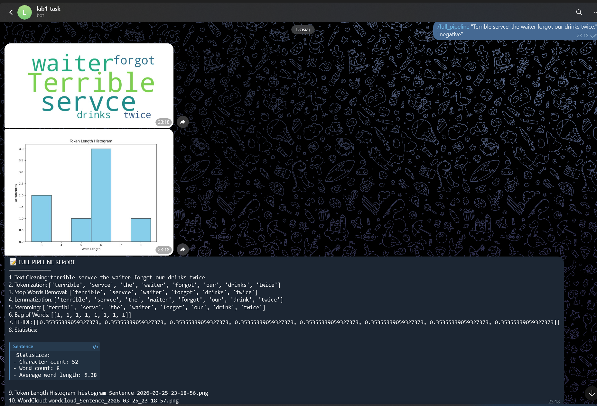
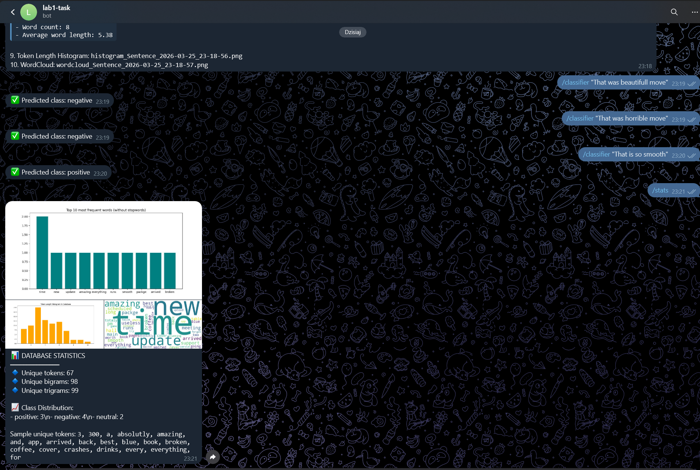

### Analysis Examples

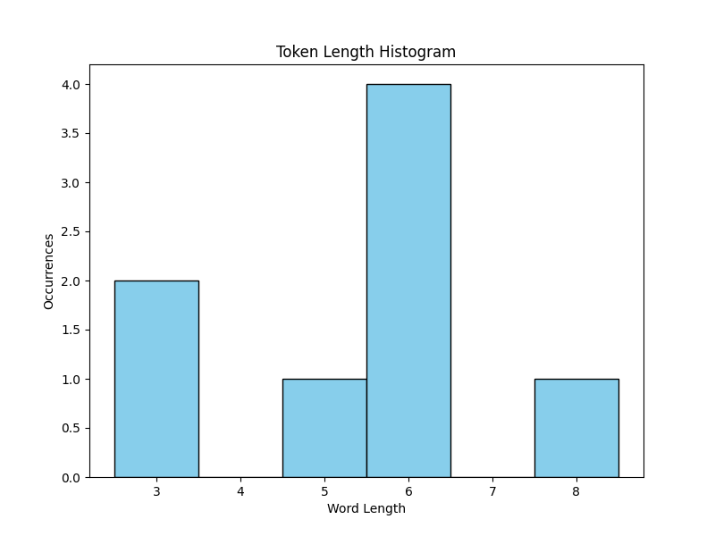
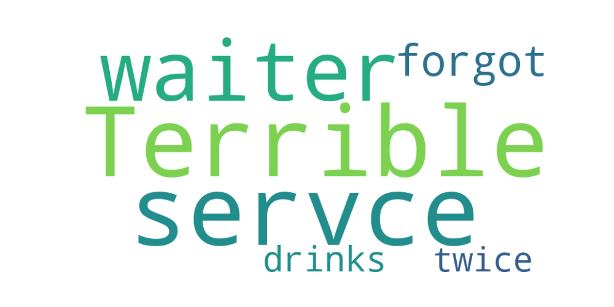
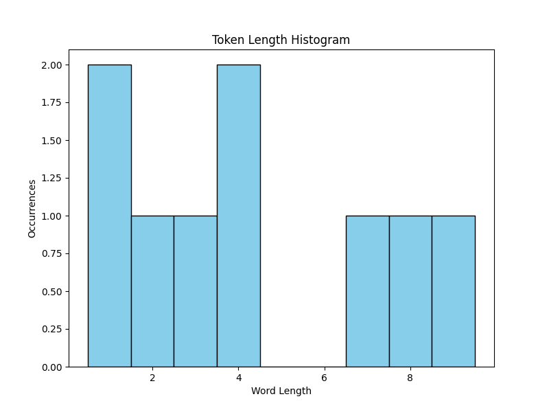
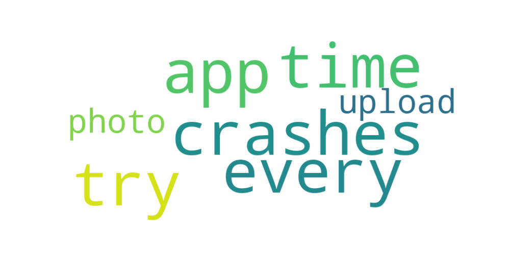

### Statistics

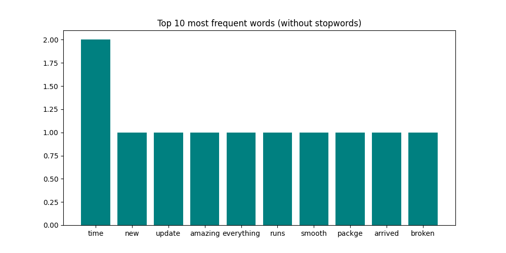
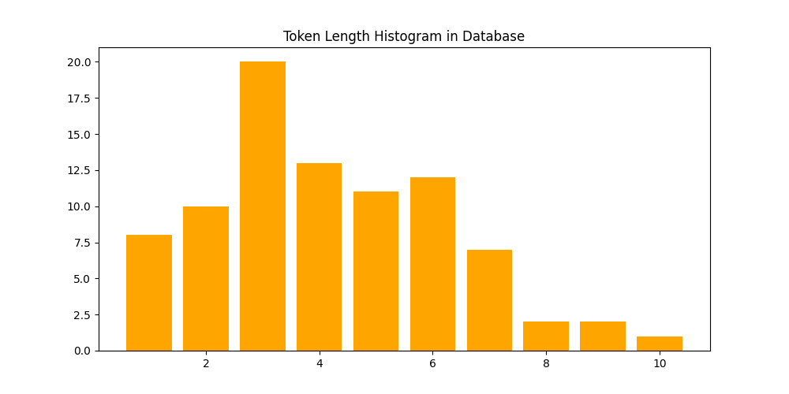
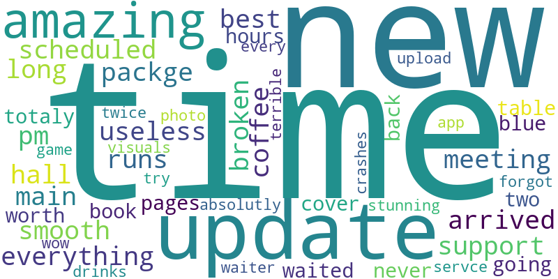

